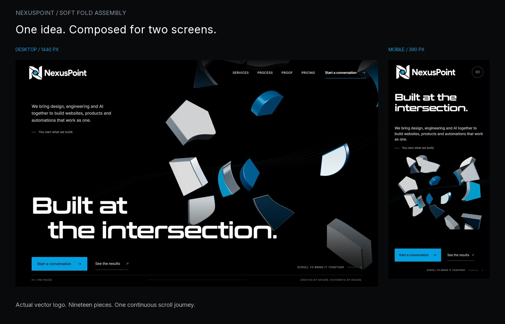
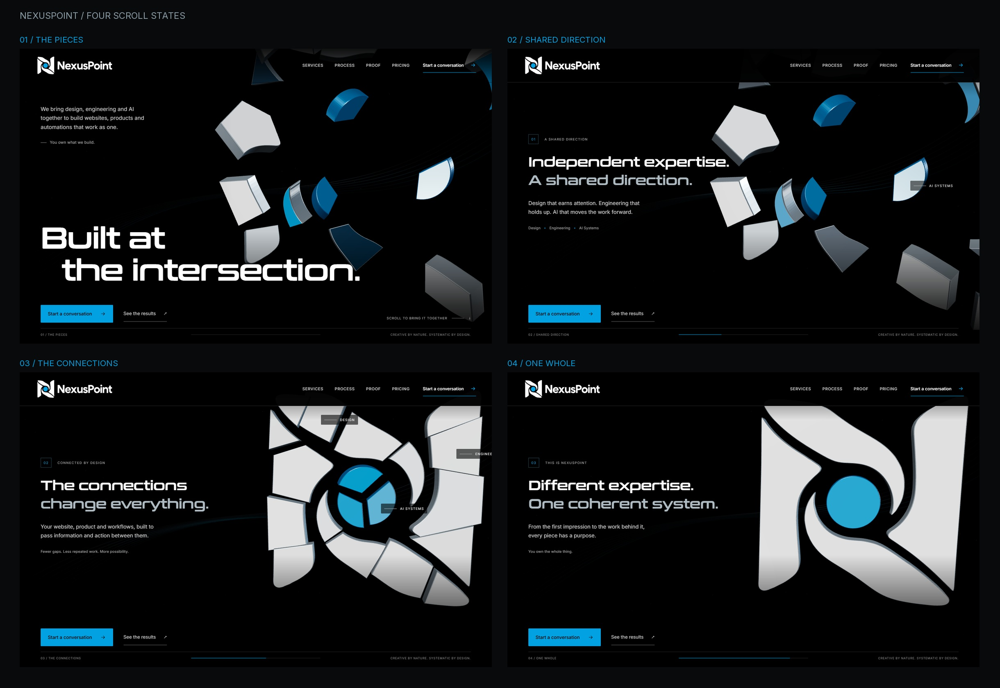

# NexusPoint: Soft Fold assembly

Homepage hero and header review, October 2, 2026.

The current hero uses the approved NexusPoint logo as its artwork. Nineteen solids, 16 white-fold segments and three blue-point segments, move and rotate into the complete Soft Fold mark. A longer scroll journey connects the changing arrangement to design, engineering and AI working as one system. Studio lighting gives the pieces depth; faint energy traces respond to scrolling and pointer movement behind them.

**The former fan-like sculpture is superseded.** Aleem rejected the separate fold, rib and filament direction. Its code and review packet are archived in [confluence-rejected-fan-2026-10-02](../../../archives/confluence-rejected-fan-2026-10-02/). Earlier `composition-review/`, `final/` and fan performance reports are historical, not current design or validation evidence.

## Current opening views

[Desktop opening](logo-final/production/1440.png) · [Mobile opening](logo-final/production/390.png) · [All responsive captures and motion frames](logo-final/production/)

## Scroll storyboard

| State | Artwork and message |
|---|---|
| Opening | Independent pieces hold around the focal area. “Built at the intersection.” and both actions are visible. |
| Shared direction, about 30% | The segments begin aligning through depth. “Independent expertise. A shared direction.” |
| Connections, about 58% | The moving surfaces increasingly read as one mark. “The connections change everything.” |
| One whole, about 86% | The assembled logo uses original continuous contours without internal seams. “Different expertise. One coherent system.” |

The last part of the journey darkens into the existing next section. Both HTML CTAs remain available throughout the pinned hero.

[Full motion frames](logo-final/production/phases/) · [Segmentation validation](logo-segmentation.json)

## Implementation

- Approved SVG contours are divided into 19 solids and extruded with thickness and bevelled edges. The assembled surfaces dissolve into unsplit contours over 76.5–80.5% progress, gradually removing the interior cuts.
- The sticky hero spans 500svh on desktop and 440svh on mobile. Lenis supplies the portfolio's wheel feel at `lerp: 0.08`; touch scrolling remains native. One linear GSAP timeline drives the reversible chapters.
- Seven restrained energy traces and 62 motes respond to input. GPU drawing stops at rest, offscreen and in hidden tabs.
- Real HTML content and links ship immediately, including a permanent accessible page heading. Responsive posters are rendered from the same logo scene. Static reduced-motion, no-JavaScript, no-WebGL and data-saving modes remove the extended track.
- DPR is capped at 2 desktop and 1.25 mobile. Context loss restores the poster; BFCache and deep links have explicit restoration handling.
- The header retains the intact official lockup, desktop destinations and accessible mobile navigation. Lower sections and contact handling remain in place.

## Image exploration

The earlier three Higgsfield concepts had authenticated estimates of $0.08 each, $0.24 total, within the $15 cap. The account ledger was not reconciled. No additional images were generated for this logo revision. Previous concepts are retained as exploration history and are not runtime artwork.

[Safe prompts and request metadata](../concepts/manifest.json) contain no credentials. The website contains no Higgsfield client credentials or runtime API calls.

## Verification

See [production interaction checks](logo-final/production/assertions.json), [scroll-phase accessibility](logo-final/axe/report.json) and [validation results](validation.md) for responsive captures, console errors, fallback behaviour and production Lighthouse medians.

Earlier fan Lighthouse scores are superseded. Headless screenshots and simulated Lighthouse runs do not establish performance on physical mobile hardware.
