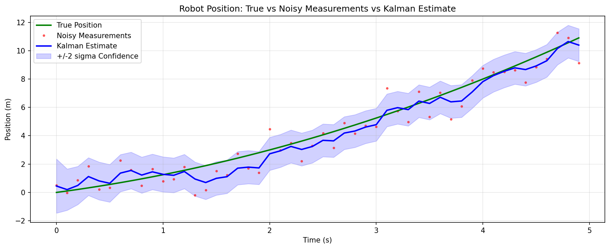
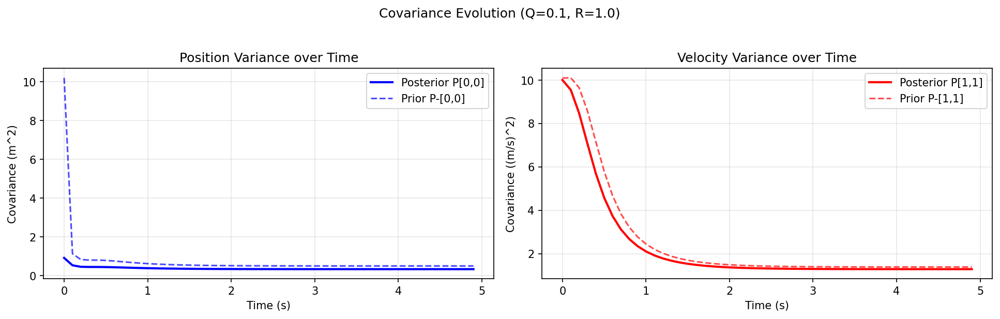
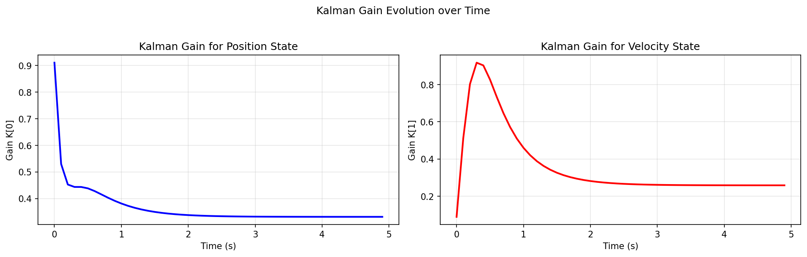
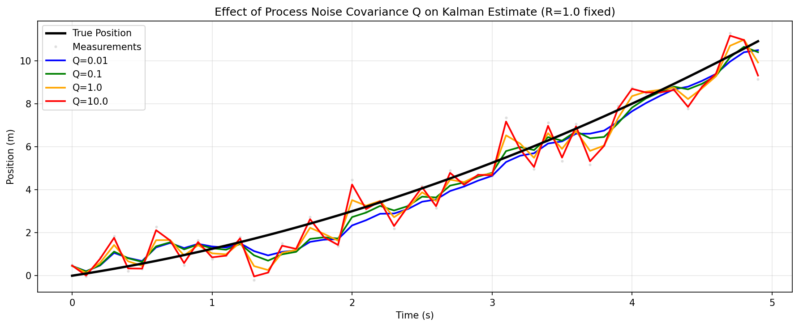
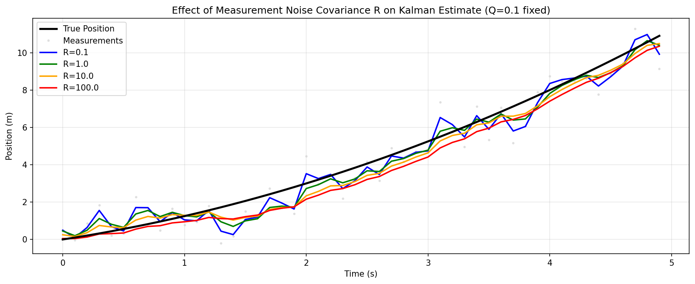
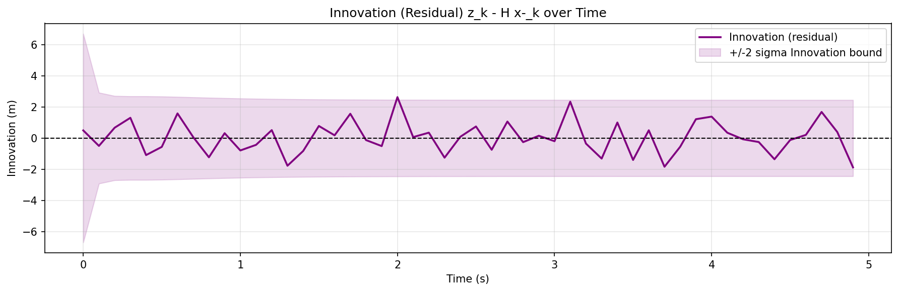

# AI for Robotics - Assignment 3 (CLO 3)
## Kalman Filter Implementation and Analysis

**Submitted by:** Aleem Ul Hassan
**Date:** June 9, 2026
**Course:** AI for Robotics

---

## 1. Objective

Understand the mathematical foundations of the Kalman Filter and apply it to estimate the true position of a mobile robot moving along a straight path, given noisy sensor measurements.

---

## 2. Methodology

### 2.1 Problem Setup

A mobile robot travels along a 1D straight path under constant acceleration. A position sensor provides measurements at each time step, but these measurements are corrupted by Gaussian noise. The Kalman Filter is used to fuse the motion model (prediction) with sensor data (correction) to produce a statistically optimal state estimate.

### 2.2 State Space Model

The robot state is represented as a 2D vector:

```
x_k = [position, velocity]^T
```

**Process Model:**
```
x_k = A * x_{k-1} + B * u_k + w_k
```

**Measurement Model:**
```
z_k = H * x_k + v_k
```

Where:
- `w_k ~ N(0, Q)` is process noise (model uncertainty)
- `v_k ~ N(0, R)` is measurement noise (sensor noise)

### 2.3 System Matrices

| Matrix | Value | Meaning |
|--------|-------|---------|
| A | [[1, dt], [0, 1]] | State transition (constant velocity model) |
| B | [[0.5*dt^2], [dt]] | Control input matrix (acceleration) |
| H | [[1, 0]] | Observation matrix (position only) |
| Q | 0.1 * I_2 | Process noise covariance |
| R | [[1.0]] | Measurement noise covariance |

**Simulation parameters:** `dt = 0.1 s`, `T = 50 steps`, `a_true = 0.5 m/s^2`, `v_0 = 1.0 m/s`

---

## 3. Kalman Filter Equations

### Prediction Step

```
x^-_k = A * x^_hat_{k-1} + B * u_k          (state prediction)
P^-_k = A * P_{k-1} * A^T + Q               (covariance prediction)
```

### Correction Step

```
K_k = P^-_k * H^T * (H * P^-_k * H^T + R)^-1   (Kalman gain)
x^_hat_k = x^-_k + K_k * (z_k - H * x^-_k)      (state update)
P_k = (I - K_k * H) * P^-_k                      (covariance update)
```

The term `(z_k - H * x^-_k)` is the **innovation** (residual) -- the difference between the actual measurement and the predicted measurement.

---

## 4. Implementation

```python
def kalman_filter(z, A, B, H, Q, R, u=None):
    T_steps = len(z)
    n = A.shape[0]
    m = H.shape[0]

    if u is None:
        u = np.zeros((B.shape[1], T_steps))

    x_est  = np.zeros((n, T_steps))
    P_est  = np.zeros((n, n, T_steps))
    x_pred = np.zeros((n, T_steps))
    P_pred = np.zeros((n, n, T_steps))
    K_hist = np.zeros((n, m, T_steps))
    innov  = np.zeros((m, T_steps))

    x = np.array([[0.0], [0.0]])    # initial state estimate
    P = 10.0 * np.eye(n)            # initial covariance (high uncertainty)

    for k in range(T_steps):
        uk = u[:, k:k+1]
        zk = np.array([[z[k]]])

        # Prediction Step
        x_minus = A @ x + B @ uk
        P_minus = A @ P @ A.T + Q

        # Correction Step
        S = H @ P_minus @ H.T + R
        K = P_minus @ H.T @ np.linalg.inv(S)
        e = zk - H @ x_minus           # innovation
        x = x_minus + K @ e
        P = (np.eye(n) - K @ H) @ P_minus

        # Store results
        x_pred[:, k] = x_minus.flatten()
        P_pred[:, :, k] = P_minus
        x_est[:, k]  = x.flatten()
        P_est[:, :, k] = P
        K_hist[:, :, k] = K
        innov[:, k]  = e.flatten()

    return x_est, P_est, x_pred, P_pred, K_hist, innov
```

**Initial conditions:** State estimate `x_0 = [0, 0]^T`, covariance `P_0 = 10 * I` (large initial uncertainty).

---

## 5. Results

### 5.1 Quantitative Results (Baseline: Q=0.1, R=1.0)

| Metric | Value |
|--------|-------|
| RMSE - Noisy Measurements | 0.9514 m |
| RMSE - Kalman Estimate | 0.5429 m |
| Noise Reduction | 42.9% |
| Final Position Variance P[0,0] | 0.3316 m^2 |
| Final Velocity Variance P[1,1] | 1.2829 (m/s)^2 |
| Final Kalman Gain K[0] | 0.3316 |
| Final Kalman Gain K[1] | 0.2586 |

The Kalman Filter reduced position estimation error by **42.9%** compared to raw measurements.

### 5.2 Plots

**Plot 1 -- Position Estimate vs Measurements**


The Kalman estimate (blue line) closely tracks the true position (green), while raw measurements (red dots) scatter around it. The shaded blue region shows the 2-sigma confidence interval, which narrows quickly as the filter gains confidence.

**Plot 2 -- Covariance Evolution**


Both position and velocity variances drop sharply from the high initial value (P_0 = 10) and converge to a steady-state value within ~10 steps. The prior covariance (dashed) is always slightly higher than the posterior (solid), confirming that measurements always reduce uncertainty.

**Plot 3 -- Kalman Gain over Time**


Both gain components K[0] (position state) and K[1] (velocity state) start high (trusting measurements more when uncertainty is large) and decay to a constant steady-state value as the covariance stabilizes. This is characteristic of an optimal filter.

**Plot 4 -- Effect of Varying Q**


- Small Q (0.01): The filter trusts the motion model strongly, producing a smooth but potentially lagging estimate.
- Large Q (10.0): The filter trusts measurements more, producing a noisier estimate that tracks the data closely but reacts to measurement spikes.

**Plot 5 -- Effect of Varying R**


- Small R (0.1): Low measurement noise assumed; filter follows measurements tightly and responds to noise.
- Large R (100.0): High measurement noise assumed; filter trusts the model more, producing a smoother but less responsive estimate.

**Plot 6 -- Innovation (Residual)**


The innovation `z_k - H * x^-_k` oscillates randomly around zero and stays within the 2-sigma bounds, indicating the filter is well-calibrated. A systematic trend or innovation exceeding bounds would indicate model mismatch.

---

## 6. Analysis Questions

### Q1. What is the significance of the Kalman Gain?

The Kalman Gain `K_k` controls how much weight is given to the new measurement versus the prediction.

- When `K_k -> 0`: The filter trusts the model (prediction) and largely ignores the measurement. This happens when measurement noise R is large relative to prediction uncertainty P^-.
- When `K_k -> 1` (or H^{-1}): The filter fully trusts the measurement and ignores the prediction. This happens when P^- is large (high model uncertainty) relative to R.

Mathematically, K balances the tradeoff between prediction uncertainty P^- and measurement uncertainty R. It is the optimal weighting in the minimum mean-square-error (MMSE) sense.

### Q2. Why does the covariance generally decrease after updates?

The correction step computes: `P_k = (I - K_k * H) * P^-_k`

Since `K_k * H` is a positive semi-definite matrix, the posterior covariance `P_k` is always less than or equal to the prior `P^-_k`. Incorporating a measurement (even a noisy one) always provides additional information that reduces uncertainty. This is a fundamental result from Bayesian estimation: conditioning on new data never increases uncertainty.

### Q3. What happens when R is increased significantly?

Increasing R signals that the sensor is very noisy and less reliable. The filter response:
- Kalman Gain K decreases (less weight to measurements)
- The filter relies more on the motion model prediction
- Estimates become smoother but lag behind the true trajectory
- The filter becomes more resistant to measurement outliers
- In the extreme (R -> infinity), the filter ignores measurements entirely and becomes pure dead reckoning

From Plot 5: at R=100, the estimate is noticeably smoother but diverges slightly from the true position, especially where the prediction model accumulates drift.

### Q4. What happens when Q is increased significantly?

Increasing Q signals high uncertainty in the motion model (process noise is large). The filter response:
- Prior covariance P^- grows faster each step
- Kalman Gain K increases (more weight to measurements)
- The filter tracks measurements more closely
- Estimates become noisier and more reactive
- In the extreme (Q -> infinity), the filter ignores the model and returns raw measurements

From Plot 4: at Q=10, the estimate is noisy and closely follows measurement fluctuations. At Q=0.01, the estimate is smooth but may lag during rapid changes.

### Q5. Why is the Kalman Filter optimal for linear Gaussian systems?

The Kalman Filter is the **minimum mean-square-error (MMSE) estimator** for linear Gaussian systems. Several reasons:

1. **Linear Gaussian closure:** If the prior and noise are Gaussian, the posterior is also Gaussian. The Kalman Filter exactly propagates the mean and covariance of this Gaussian, fully characterizing the distribution.
2. **MMSE optimality:** Among all possible estimators (linear or nonlinear), the posterior mean minimizes the expected squared error when the system is linear and Gaussian.
3. **Sufficient statistics:** The Gaussian distribution is fully characterized by its mean and covariance. The Kalman Filter maintains exactly these two quantities, so no information is lost.
4. **Recursive structure:** It processes data sequentially and never needs to store the full measurement history, making it computationally efficient while remaining optimal.

This optimality is proven by the **Gauss-Markov theorem** and is a special case of the general Bayesian filter for Gaussian conditionals.

### Q6. What is the innovation (residual) and why is it important?

The innovation at time step k is:
```
e_k = z_k - H * x^-_k
```
It is the difference between the actual measurement and the predicted measurement.

**Importance:**
1. **Core of the update:** The state correction is entirely driven by the innovation -- `x_k = x^-_k + K_k * e_k`. If the innovation is zero, no correction occurs.
2. **Filter health diagnostic:** In a well-tuned filter, innovations should be zero-mean, white (uncorrelated), and Gaussian with covariance `S = H P^- H^T + R`. Any systematic trend, autocorrelation, or innovation exceeding its bounds indicates model mismatch, wrong Q/R, or sensor bias.
3. **Information measure:** The innovation represents new information not already captured by the model. Large, consistent innovations indicate the model is failing to predict the system behavior.

From Plot 6, the innovations oscillate randomly around zero within the 2-sigma bounds, confirming a well-calibrated filter.

### Q7. Compare prediction uncertainty and measurement uncertainty

| Aspect | Prediction Uncertainty (P^-) | Measurement Uncertainty (R) |
|--------|------------------------------|------------------------------|
| Source | Accumulated process noise + model error | Sensor noise variance |
| Representation | Full state covariance matrix (n x n) | Measurement noise covariance (m x m) |
| Evolution | Grows each prediction step via Q | Fixed (constant sensor quality) |
| Effect on K | High P^- -> high K (trust measurements more) | High R -> low K (trust model more) |
| Baseline value | Starts at 10, converges to ~0.33 | Fixed at 1.0 |

The relative magnitude of P^- vs R determines the Kalman Gain. When P^- >> R (early steps with high initial uncertainty), the filter heavily weights measurements. As P^- converges to steady state, the gain stabilizes and the filter balances both sources equally.

### Q8. How would the approach change for nonlinear systems?

The standard Kalman Filter requires linear A, B, H matrices. For nonlinear systems `x_k = f(x_{k-1}, u_k) + w_k` and `z_k = h(x_k) + v_k`, several extensions exist:

1. **Extended Kalman Filter (EKF):** Linearizes f and h around the current estimate using first-order Taylor expansion (Jacobians). Fast but can diverge if linearization error is large.

2. **Unscented Kalman Filter (UKF):** Propagates a set of carefully chosen "sigma points" through the nonlinear functions to capture the mean and covariance more accurately. Better accuracy than EKF without full linearization.

3. **Particle Filter (Sequential Monte Carlo):** Represents the posterior distribution as a set of weighted particles. Can handle arbitrary nonlinear/non-Gaussian systems but is computationally expensive.

4. **Invariant EKF (IEKF):** Uses Lie group structure for systems on manifolds (e.g., SE(3) for 3D robot pose), achieving better convergence properties.

For the robot example in this assignment, if the robot moves in 2D with heading, the measurement model becomes nonlinear (e.g., radar range/bearing), requiring EKF or UKF.

---

## 7. Discussion and Filter Behaviour Interpretation

### Overall Performance

The Kalman Filter achieved a **42.9% reduction in RMSE** (0.95 m -> 0.54 m) compared to raw measurements. This demonstrates the filter's core value: it extracts more information from the same noisy data by combining model predictions with measurements.

### Convergence Behaviour

The covariance converges within approximately 10 time steps from the high initial uncertainty (P_0 = 10) to a steady state (~0.33 for position). This convergence corresponds to the filter "learning" the right balance between model and measurement trust. After convergence, the Kalman Gain stabilizes and the filter operates in a near-stationary regime.

### Steady-State Analysis

At steady state, the filter runs as a constant-gain filter. The steady-state gain can also be computed from the algebraic Riccati equation, confirming the filter has reached its optimal operating point. The final gains K[0] = 0.332 and K[1] = 0.259 show that position corrections are slightly stronger than velocity corrections, which is expected since position is directly observed.

### Tuning Guidance

- If the model is accurate: keep Q small, R matched to sensor specs
- If the model drifts (unmodeled dynamics): increase Q to make the filter more adaptive
- If the sensor is unreliable: increase R to rely more on the model
- The ratio Q/R governs the filter's balance -- it is the single most important tuning parameter

---

## 8. Conclusion

The Kalman Filter was successfully implemented for a mobile robot position estimation problem. The filter:

- Reduced RMSE by 42.9% versus raw measurements
- Converged to a stable covariance within 10 time steps
- Demonstrated expected behaviour with varying Q and R parameters
- Produced well-calibrated innovations that remained within 2-sigma bounds

The results confirm the Kalman Filter as the optimal linear estimator for this Gaussian noise system, providing a principled, recursive solution that outperforms naive averaging or raw sensor use.

---

## References

- Kalman, R.E. (1960). A New Approach to Linear Filtering and Prediction Problems. *Journal of Basic Engineering*, 82(1), 35-45.
- Thrun, S., Burgard, W., Fox, D. (2005). *Probabilistic Robotics*. MIT Press.
- Bar-Shalom, Y., Li, X.R., Kirubarajan, T. (2001). *Estimation with Applications to Tracking and Navigation*. Wiley.
